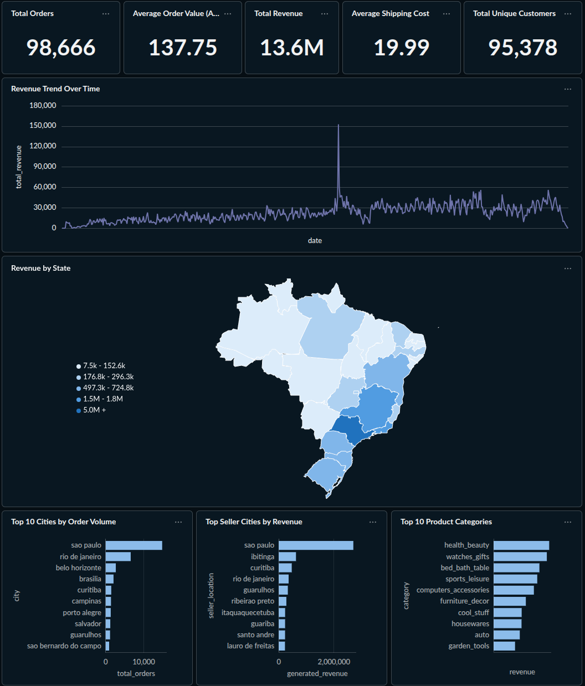
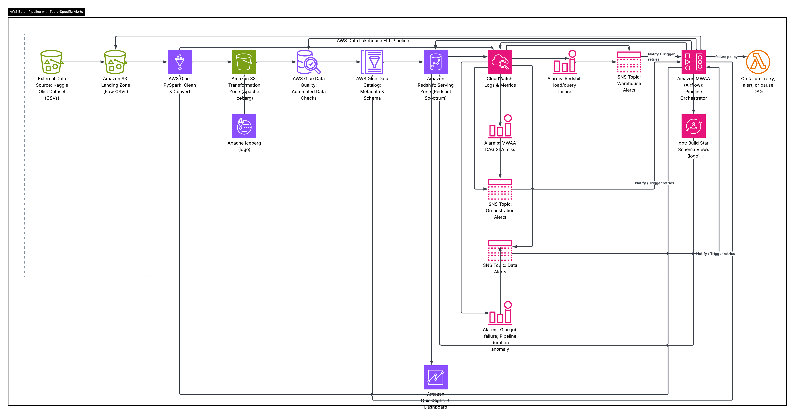
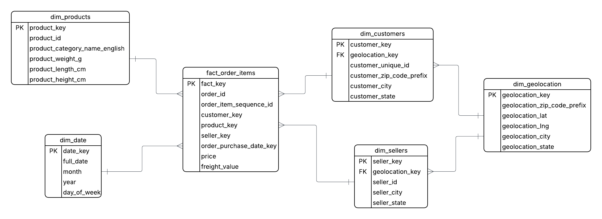

# 🛒 Olist E-Commerce Data Lakehouse 


## 📌 Project Overview
This project builds a fully automated, serverless **Data Lakehouse** using the Brazilian E-Commerce Public Dataset by Olist. It demonstrates a modern ELT (Extract, Load, Transform) workflow, utilizing Infrastructure as Code (IaC), distributed processing, and modern data modeling techniques to prepare raw e-commerce data for Business Intelligence and analytics.

## 📊 Executive Summary Dashboard
*Built using Metabase connected directly to the Amazon Athena Gold Layer.*


## 🏗️ Architecture


The pipeline follows a modern Medallion-style Lakehouse architecture:
1. **Infrastructure:** Provisioned entirely via **Terraform** (S3 Buckets, IAM Roles, AWS Glue Catalog).
2. **Data Extraction & Loading (Silver Layer):** Raw CSVs landing in Amazon S3 are processed by **AWS Glue (PySpark)**. Data is cleaned, deduplicated, and converted into the highly optimized **Apache Iceberg** table format.
3. **Data Transformation (Gold Layer):** **dbt (data build tool)** connects to **Amazon Athena** to transform the base Iceberg tables into a Kimball-style Star Schema using pure SQL. 
4. **Data Quality:** Automated testing via dbt ensures primary key uniqueness and validates business logic (e.g., preventing negative transaction prices).
5. **Orchestration:** The entire Directed Acyclic Graph (DAG) is scheduled and monitored using **Apache Airflow** running locally via Docker.

## 🛠️ Tech Stack
* **Cloud Provider:** Amazon Web Services (AWS)
* **Infrastructure as Code:** Terraform
* **Data Lake Storage:** Amazon S3
* **Data Processing (EL):** AWS Glue, PySpark
* **Data Transformation (T):** dbt (dbt-athena adapter), SQL
* **Query Engine:** Amazon Athena (Serverless)
* **Table Format:** Apache Iceberg, Parquet
* **Orchestration:** Apache Airflow (Astro CLI)
* **Visualization:** Python (Seaborn/Matplotlib) / AWS QuickSight

## 📊 Data Modeling (Star Schema)

The transformation layer takes normalized transactional data and converts it into a read-optimized Star Schema centered around order items:

* **Fact Table:** `fact_order_items`
* **Dimension Tables:** * `dim_customers`
  * `dim_products` (Enriched with English category translations)
  * `dim_sellers`
  * `dim_geolocation`
  * `dim_date`

## 🚀 How to Run the Pipeline

### 1. Provision Infrastructure
```bash
cd terraform
terraform init
terraform apply

### 2. Start the Airflow Orchestrator
Ensure Docker is running, then use the Astro CLI to spin up the local Airflow environment:

```bash
cd olist_airflow
astro dev start
```

### 3. Trigger the DAG
Navigate to `http://localhost:8080` (admin/admin), unpause the `olist_lakehouse_pipeline`, and trigger the DAG. Airflow will automatically:
* Execute the PySpark job via the `GlueJobOperator`.
* Wait for successful completion.
* Execute `dbt run` and `dbt test` via the `BashOperator` to build and validate the Star Schema.

## 🔮 Future Enhancements
* Implement **Great Expectations** at the PySpark layer for strict data contracts before data enters the Lakehouse.
* Set up **GitHub Actions (CI/CD)** to automatically test and deploy dbt models to a production Athena environment upon pull request merges.
